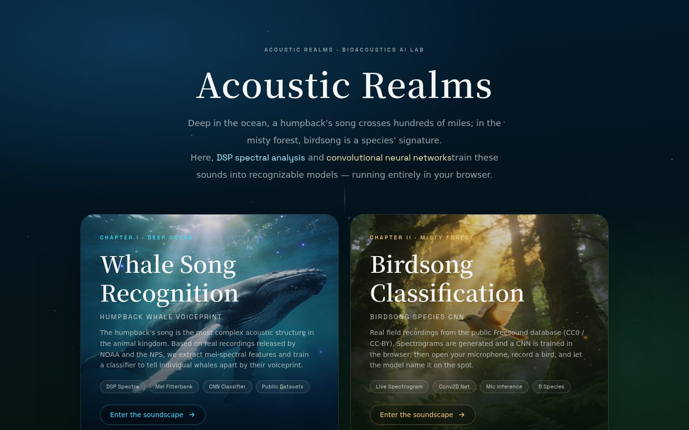
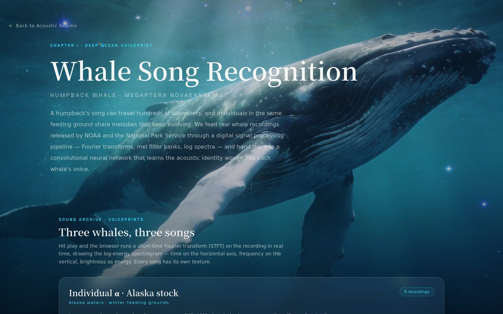
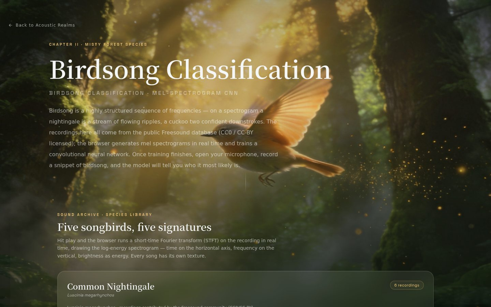

# Acoustic Realms

**An in-browser bioacoustics AI lab — humpback whale voiceprint recognition & birdsong species classification.**

Deep in the ocean, a humpback's song crosses hundreds of miles. In the misty forest,
birdsong is a species' signature. This project turns real public recordings of both
into trainable models — entirely inside your browser, with zero servers, zero API
calls, and zero uploads.



## Screenshots

| | |
|---|---|
| **Landing** — two chapter entrances | **Chapter I · Whale Song** — archive, training, identification |
|  |  |
| **Chapter II · Birdsong** — mic recording + species CNN | |
|  | |

## What's inside

### Chapter I — Whale Song Recognition (`/whale`)
Three individual humpback whales, recorded by NOAA/PMEL, Glacier Bay National Park
and the Ocean Mammal Institute. The page walks you through:

- **Sound Archive** — play each recording and watch its live log-energy spectrogram
  (STFT, 40-band mel filterbank)
- **Training Lab** — a three-layer Conv2D CNN (16/32/64 filters) trained on 40×64
  log-mel segments in real time, with live loss/accuracy curves and a confusion matrix
- **Identification Console** — after training, classify any recording from the
  library, an uploaded file, or your own microphone

### Chapter II — Birdsong Classification (`/bird`)
Five songbirds from the public Freesound database (CC0 / CC-BY): Common Nightingale,
Common Cuckoo, Common Blackbird, European Robin, Great Tit. Same pipeline — then open
your microphone, record a few seconds of birdsong, and the model names the singer.

## How it works

All DSP is real signal processing in TypeScript:

```
decode (Web Audio) → resample to 22.05 kHz mono
→ STFT (1024 FFT, 512 hop) → mel filterbank (40 bands)
→ log-mel segments (40 × 64) → Conv2D CNN (TensorFlow.js)
```

- `src/lib/audio/dsp.ts` — decoding, FFT, STFT, mel filterbank, MFCC
- `src/lib/audio/colormap.ts` — spectrogram thermal palette
- `src/lib/ml/cnn.ts` — browser-side CNN training & prediction
- `src/lib/audio/dataset.ts` — dataset manifest loader
- `scripts/collect-audio.mjs` — regenerate the dataset from public sources
- `public/media/audio/` — the bundled recordings (whales: α/β/γ · birds: 5 species)

Training runs on your device via TensorFlow.js. Audio never leaves the browser.

## Quick start

Requires Node 20+ and [pnpm](https://pnpm.io).

```bash
pnpm install
pnpm dev        # dev server on :5000
pnpm build      # production build + bundled server
pnpm start      # run dist/server.js
```

## Project structure

```
src/
├── app/                     # pages: home, /whale, /bird
├── components/
│   ├── cinematic/           # VideoBackground, PageHero, ChapterCard
│   └── lab/                 # SoundArchive, SpectrogramPlayer, TrainingPanel,
│                            # RecognitionPanel, MicRecorder
└── lib/
    ├── audio/               # dsp, colormap, dataset
    └── ml/                  # cnn, useTrainer
scripts/                     # build/dev/start + dataset collection
public/media/                # posters, audio recordings
```

## Credits & licenses

- Whale recordings: NOAA/PMEL Acoustics Program, Glacier Bay National Park (NPS),
  Ocean Mammal Institute — public research recordings
- Bird recordings: Freesound.org community recordists (CC0 / CC-BY)
- Ambient cinematic clips: AI-generated

Educational project. Built with Next.js 16, React 19, TypeScript, Tailwind CSS 4,
TensorFlow.js. License: Apache-2.0 — see [LICENSE](LICENSE).
